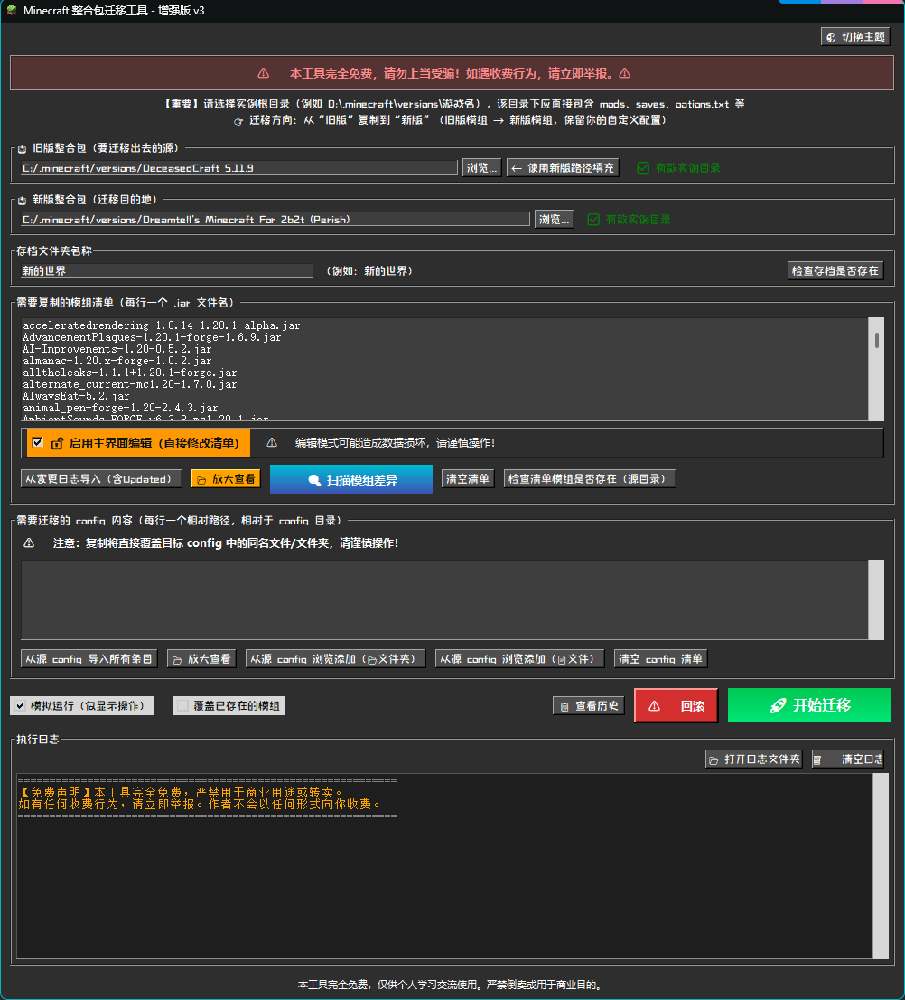

# 🧳 Minecraft 存档迁移工具

[](LICENSE)
[](https://github.com/Dreamtell/Minecraft-Migration-Tool/releases)
[](https://github.com/Dreamtell/Minecraft-Migration-Tool/issues)
[](https://github.com/Dreamtell/Minecraft-Migration-Tool/stargazers)

**版本：v3.3** · 开源 · 免费 · 纯中文界面

> 一款用于在不同 Minecraft 整合包实例之间迁移 **模组、配置文件、存档和设置** 的图形化工具。  
> 由 Dreamtell 与 AI DeepSeek 协作完成，源码完全开源。

---

## ✨ 功能特性

- 🚀 **一键迁移**：从旧版整合包迁移到新版，保留你的自定义配置和存档
- 🧩 **智能模组差异扫描**：基于 `modId` 和版本号识别差异，支持 Fabric 与 Forge
- 📁 **灵活清单管理**：手动编辑或自动导入模组和 config 清单
- 🔄 **备份与回滚**：迁移前自动备份目标实例，随时恢复到之前状态
- 📜 **迁移历史记录**：记录每次迁移详情，支持查看和回滚标记
- 🌓 **深色/浅色主题**：随心切换，保护眼睛
- 🧪 **模拟运行**：预览操作效果，避免误操作
- 🔒 **路径安全检查**：防止 config 清单中的 `..` 路径越界
- 🖥️ **放大查看窗口**：支持搜索、编辑和同步，方便管理长清单

---

## 📦 下载与安装

### 方法一：使用预编译可执行文件（推荐）
- 前往 [Releases](https://github.com/Dreamtell/Minecraft-Migration-Tool/releases) 下载最新 `.exe` 文件
- 双击运行即可，无需安装 Python 或任何依赖

### 方法二：从源码运行

1. 克隆仓库：
   ```bash
   git clone https://github.com/Dreamtell/Minecraft-Migration-Tool.git
   cd Minecraft-Migration-Tool
   ```

2. 安装依赖：
   ```bash
   pip install pygame tendo
   ```

3. 运行：
   ```bash
   python "Minecraft存档迁移工具.py"
   ```

> **提示**：`pygame` 仅用于启动动画，如果不需要可移除相关代码。

---

## 🎮 使用指南

### 基本流程

1. **选择源实例根目录**  
   旧版整合包，例如 `D:\.minecraft\versions\1.20.1-old`

2. **选择目标实例根目录**  
   新版整合包，例如 `D:\.minecraft\versions\1.21-new`

3. **填写存档名称**  
   要迁移的存档文件夹名，例如 `我的生存世界`

4. **编辑模组清单**  
   每行一个 `.jar` 文件名，可通过“扫描模组差异”快速生成

5. **编辑 Config 清单**  
   每行一个相对路径，指向 `config` 目录下的文件或文件夹

6. **点击 🚀 开始迁移**

### 高级功能

| 功能 | 说明 |
|------|------|
| 模拟运行 | 勾选后仅显示操作，不实际修改文件 |
| 覆盖已存在的模组 | 勾选后若目标已有同名模组，则覆盖 |
| 扫描模组差异 | 自动比对源和目标 `mods` 目录，一键导入清单 |
| 回滚 | 迁移后若出问题，可一键恢复到迁移前的状态 |
| 查看历史 | 查看该目标实例的所有迁移记录 |
| 放大查看 | 大窗口查看/编辑清单，支持搜索和同步 |

---

## 🖥️ 界面预览

> *（建议在此处插入一张程序运行截图，命名为 `screenshot.png` 放在仓库根目录）*



---

## 🛠️ 开发与构建

### 使用 PyInstaller 打包为 EXE

```bash
pip install pyinstaller
pyinstaller --onefile --windowed --icon=1.ico "Minecraft存档迁移工具.py"
```

### 依赖说明

| 依赖 | 用途 | 是否必需 |
|------|------|----------|
| `tkinter` | 图形界面 | ✅ 必需（Python 自带） |
| `pygame` | 启动动画 | ❌ 可选（无则跳过动画） |
| `tendo` | 单实例控制 | ✅ 必需 |

### 项目结构

```
Minecraft-Migration-Tool/
├── Minecraft存档迁移工具.py   # 主程序
├── 1.ico                      # 程序图标（可选）
├── README.md                  # 项目说明
├── LICENSE                    # MIT 协议
└── screenshot.png             # 界面截图
```

---

## 🤝 贡献指南

欢迎提交 Issue 或 Pull Request！

- 请确保代码符合 [PEP 8](https://peps.python.org/pep-0008/) 风格
- 若新增功能，请附带说明文档
- 提交前请测试功能是否正常

---

## 📝 更新日志

### v3.3 (2026-07-31)

**🐛 Bug 修复**
- 修复启动画面关闭后主窗口不创建的问题
- 修复进度轮询内存泄漏
- 修复存档检测指向目标而非源的问题（现改为检测源实例）
- 修复放大查看窗口不居中及编辑切换重置内容的问题
- 修复 `world_name` 的 `trace` 回调参数不匹配导致的错误
- 修复 config 清单中 `..` 路径越界的安全隐患

**✨ 新增与优化**
- 开始迁移按钮采用亮绿色渐变，更醒目
- 存档检测状态文字颜色：存在→绿色，不存在→红色
- 放大窗口取消编辑时保留修改内容，不重置
- 放大窗口自动居中显示
- 日志缓存自动清理（阈值 500 条），防止内存溢出
- 备份失败时迁移自动取消，避免不完整备份下继续操作

**🔧 其他**
- 优化 changelog 解析正则表达式
- 改进进度统计（递归统计目录文件数）

---

### v3.0 (初始版本)
- 基础迁移功能（模组、config、存档、options.txt）
- 模组差异扫描（元数据级）
- 备份与回滚
- 迁移历史记录
- 深色/浅色主题切换

---

## ⚠️ 免责声明与安全提醒

- 本工具完全**免费**，仅供学习交流使用
- 严禁用于**商业用途或转卖**。如遇收费行为，请立即举报
- 使用本工具造成的任何数据损失，作者概不负责
- **建议在操作前手动备份重要数据**

---

## 📧 联系与支持

- **作者**：Dreamtell
- **GitHub**：[Dreamtell](https://github.com/Dreamtell)
- **开源协议**：MIT License
- **问题反馈**：[Issues](https://github.com/Dreamtell/Minecraft-Migration-Tool/issues)

---

**如果觉得有用，请给个 ⭐ Star 支持一下！**

> 本工具由 Dreamtell 与 AI DeepSeek 协作完成，源码完全开源，欢迎 fork 和改进。