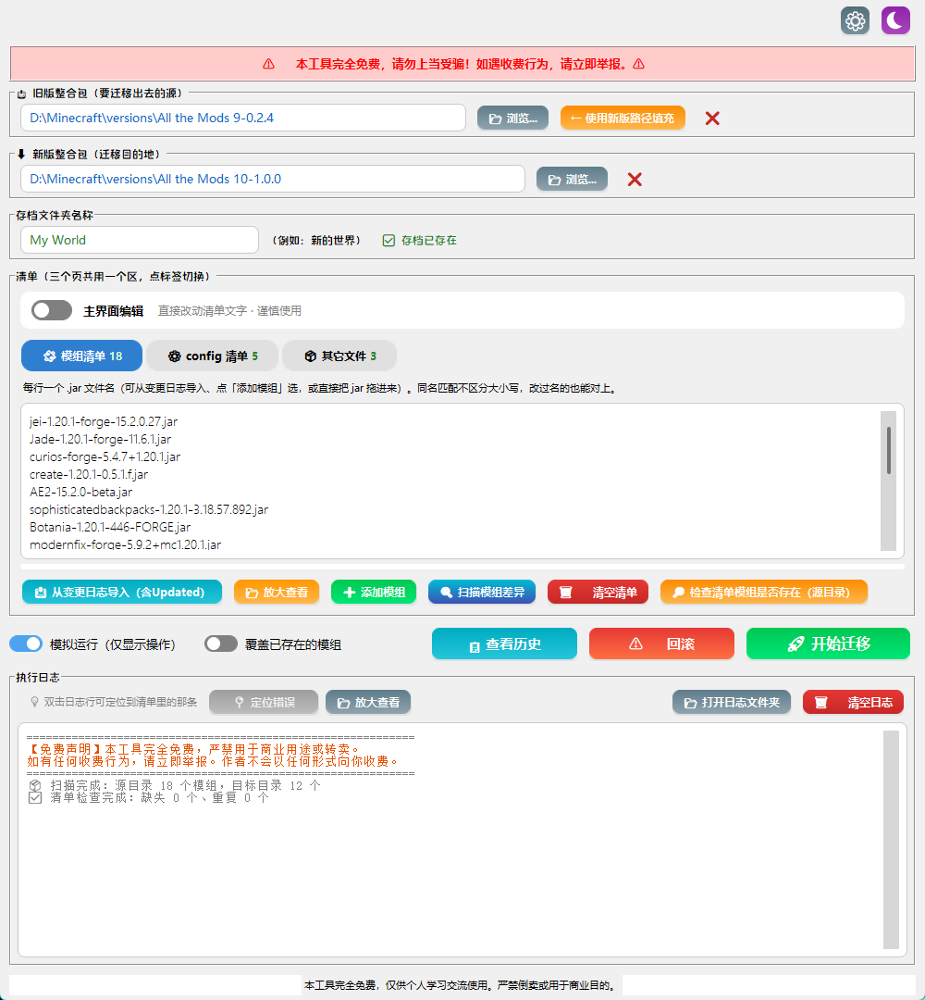
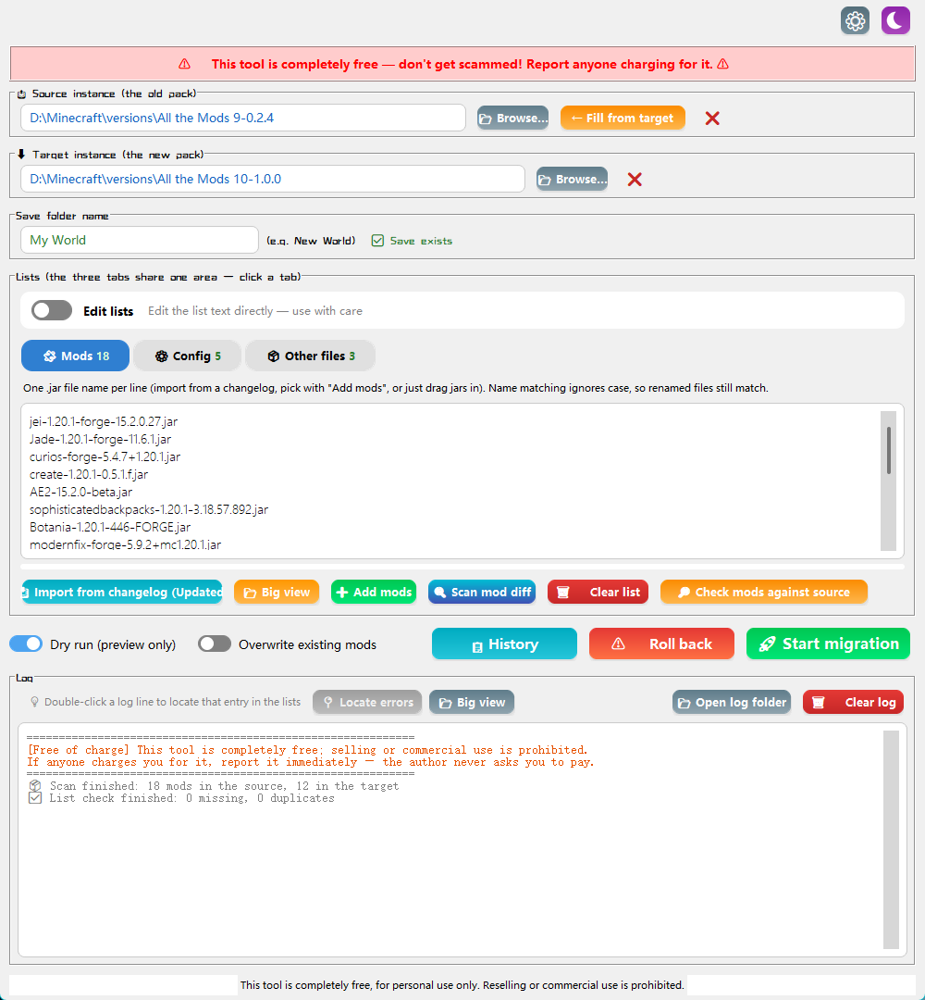
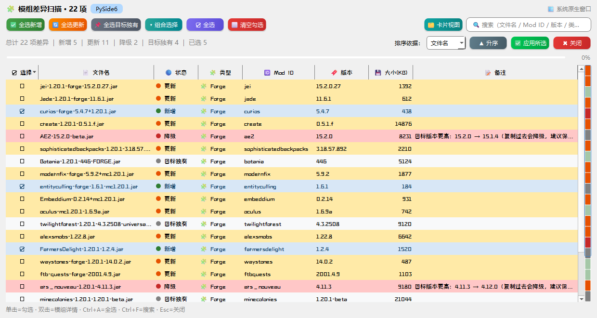
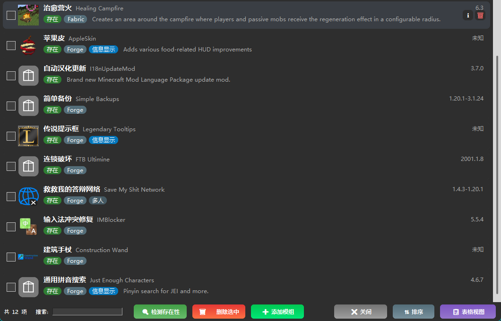

# Minecraft Modpack Migration Tool

**English** · [简体中文](README.zh-CN.md)

A free, open-source Windows desktop tool that moves **mods, configs, saves and other files** from
one Minecraft instance to another — so updating a modpack no longer means losing the setup you
have tuned for months.

- 🆓 Free and open source (MIT) — no ads, no donations, no paid tier, **no telemetry**
- 📴 The core job (migration) works fully offline
- 🪟 Windows 10 / 11 · Python 3.12 + Tkinter
- 🌐 Chinese / English UI — switch it in *Settings → Appearance & startup → Language*

---

## ✨ What it does

### 🚚 Migration
- Copies **mods → saves → config** from a source instance to a target instance.
- **Nothing else is touched unless you ask for it.** The **"Other files" list is the single source
  of truth**: an empty list means "don't move anything else". `options.txt` is *not* copied
  automatically any more — add it to that list if you want it (there is a one-click
  `＋ options.txt` button).
- **Dry run** — previews every action without modifying a single file (recommended the first time).
- **Disk space check** before starting: the tool refuses to run when the target disk cannot hold
  the incoming data *plus* the backup it is about to make.
- **Backup & rollback** — everything this migration will touch is backed up first: `mods/`,
  `config/`, `saves/` **plus every entry of your "Other files" list**. Entries that did not exist
  before are recorded in the manifest, so a rollback can delete what the migration created.
  Backups made by older versions (no extras section) still roll back.
- **Migration history** per target instance, with rollback markers.

### 🧩 Mod diff scanning
- Compares the source and target `mods` folders and classifies every jar:
  **new / updated / downgrade / target-only**.
- Versions are compared as versions (not as strings), so "the target is newer" is reported as a
  **downgrade** and left unchecked by default — copying it over would silently downgrade the pack.
- Reads metadata straight out of the jars: name, mod id, version, loader, MC version, description,
  icon; category tags are guessed from keywords (clearly marked as *guessed*) or fetched online.

### 📁 List management & big view
- The three lists (mods / config / other files) share one tabbed area with live item counts.
- Existence checks against the source directory, per-line colour feedback, duplicate detection.
- A **big view** window (table or card layout) for searching, sorting, selecting and editing —
  it follows changes made in the main window in real time.
- Drag & drop files and folders into the lists; paste paths in the Qt big view.

### 🌐 Language
- Ships in Chinese and English. Switch it in **Settings → 🎨 Appearance & startup → Language**;
  the change applies the next time you start the app (the interface is built once at startup).
- Coverage today: **the whole interface** — main window, settings, every Tk dialog and fallback
  window, the Qt windows (big view, mod diff; they run in a child process with their own
  translation layer), the execution log, and the system message boxes. Two independent checks
  report **zero** untranslated strings: a source scan over ~380 text-API literals, and a walk of
  the real widget tree in English mode.
- The dictionary (`utils/i18n.py`, 821 entries) is the only thing you touch to add a string, and
  values assembled from several pieces use `trf`/`trp` templates so they can be translated too.
- Under the hood: in Chinese (the default) the translation layer is **not installed at all**, so
  the behaviour is byte-for-byte what it was before.

### 🎨 UI
- Dark / light themes, applied consistently — including the Qt windows (which run in a separate
  process, see *Architecture* below).
- Customisable toolbar: hide the buttons you never use and reorder the rest.
- System tray: closing the window can keep a running task alive in the background.
- Animated splash screen that stays smooth (60 fps) while the main window is being built.

---

## 🔍 Online mod search (optional)

Two sources, both **read-only**:

| Source | API key | Used for |
|---|---|---|
| [Modrinth](https://modrinth.com) public API | not needed | match a local jar to a project, show the latest version and a download link |
| [CurseForge](https://www.curseforge.com) Core API | optional — see below | the same, for mods that only exist on CurseForge |

### How the CurseForge API is used — metadata only

- The tool matches a **mod the user already has on disk** to its CurseForge project and shows the
  project name, author, latest file version and supported game versions / loader.
- It **never downloads, mirrors or redistributes mod files** through the API. It shows a link to
  the **official CurseForge project / file page**, and the download happens there — on CurseForge,
  on the author's own page, with their monetisation untouched. The tool deliberately does **not**
  use the CDN `downloadUrl` returned by the API, because that would bypass the author's page.
- Requests are **triggered by explicit user action only** (opening a mod's details or pressing
  *search*). There is no background polling, no bulk crawling and no scheduled refresh.
- API data is **not cached on disk** — the 3rd-party API terms forbid saving or caching it.
  (Modrinth's public API is used the same way; its local cache only stores category *names*.)
- Online lookup is optional and isolated: if it fails, or there is no network, the migration
  itself is unaffected.

### API key handling

The key resolution order is: **your own key → environment variable → key built into the release**.

- **The repository never contains a key.** The key shipped with a release is injected at build
  time from the `MCTOOL_CF_KEY` environment variable into a git-ignored module, and it is stored
  obfuscated (XOR + base64), so `strings` on the built exe will not reveal it.
  To be explicit: **that is not encryption** — the algorithm and salt are in
  [`utils/secrets.py`](Minecraft迁移工具/utils/secrets.py) and the repository is public. It only
  defeats a casual string search. A key baked into any desktop application can always be
  extracted; that is true of every launcher in this ecosystem.
- **You can always use your own key** (Settings → *Migration & Categories*). It is stored in
  `~/.minecraft_migrate_secret.json` — **separate from the config file**, because users paste that
  config into bug reports.
- The key is **never written to logs, error messages, crash reports, the Qt child process'
  temporary request/result files, or URLs** (it travels in the `x-api-key` request header). Logs
  mention it only as "last 4 characters + fingerprint + source".
- The settings field is masked (`••••••••1234`), is cleared as soon as you save, and can be
  deleted at any time.

---

## 📦 Download & install

### Option 1 — prebuilt executable (recommended)
Download the released `.exe` and run it. No Python installation required.

> If drag & drop does not work in that build, `tkinterdnd2`'s platform files were not bundled —
> use option 2 and rebuild (the repository ships the PyInstaller hook it needs).

### Option 2 — run from source

```bash
cd Minecraft迁移工具
pip install tendo winotify tkinterdnd2 pillow pywin32 pywinstyles
python app.py
```

Optional extras:

- `pywin32` — system tray (without it, closing the window exits the app)
- `pywinstyles` — native dark title bars / Win11 rounded corners
- `PySide6` — the big-view / diff windows and the out-of-process splash screen
  (without it the tool falls back to classic Tk windows automatically)

---

## 🎮 Quick start

1. **Source instance** (📤 old) — e.g. `D:\.minecraft\versions\1.20.1-old`
   (the folder that directly contains `mods`, `saves`, `config`, …)
2. **Target instance** (📥 new) — e.g. `D:\.minecraft\versions\1.21-new`
3. **Save name** — the folder inside `saves/`; its existence in the source is checked as you type.
4. **Mod list** — one `.jar` per line. Fill it from a changelog (`Added`/`Updated` entries), from a
   diff scan of the two instances, by dragging jars in, or through the big view.
5. **Config list** — one relative path per line, relative to the source `config/` folder.
6. **Options** — *Dry run* (strongly recommended the first time) and *overwrite existing mods*.
7. **Start migration** — disk space is checked and the target is backed up before anything is
   written.

Closing the window while a task is running asks whether to keep it running in the tray; it will
not let you kill a migration by accident.

---

## 🖥️ Screenshots

**Main window** — source/target instances, save name with a live existence check, the three lists,
the options row and the live log:



**Main window in English** — the same window with the language set to English:



**Mod diff scan** — every jar classified as *new / updated / downgrade / target-only*, with
per-row selection, notes, and the distribution bar on the right:



**Card view** — the big view and diff windows switch between table and card layouts; both share
the same data, selection state and search:



---

## 🛠️ Build from source

The build script is `打包_命令行.bat` (repository root):

```bat
打包_命令行.bat                 :: build (pause at the end)
打包_命令行.bat nopause         :: build, no pause (for scripts)
打包_命令行.bat keyonly         :: only refresh the built-in API key module
```

It runs PyInstaller with `--onedir` and `--paths ..\_qt`:

- **`--onedir`, not `--onefile`** — the app relaunches itself for the splash screen; a onefile
  build would re-extract the whole archive every time and start noticeably slower.
- **`--paths ..\_qt`** — PySide6 lives in this repository's `_qt` folder rather than
  `site-packages`, so PyInstaller cannot find it otherwise.
- The CurseForge key is injected at build time (see *API key handling*) and removed from the
  source tree again when the build finishes.

---

## 📁 Project structure

```
Minecraft迁移工具/
├── app.py                 # entry point: single instance, splash, tray, close policy
├── core/                  # migrator (backup/rollback/history), scanner, Modrinth+CurseForge client
├── ui/                    # main_window.py + mw_*.py mixins, Qt subprocess windows, dialogs
└── utils/                 # self-drawn widgets, theme, config, secrets (API key handling)
```

### Architecture note

Tkinter and PySide6 cannot share one main thread in this application — doing so repeatedly caused
fatal GIL errors, so **all Qt windows run in a child process** (`app.py --qt-host <request.json>`)
and the main process never imports Qt. The two processes exchange small JSON files, and the
request, command and result files are scrubbed of secrets before they are written.

---

## 🔐 Privacy & data

Everything the tool writes stays on your machine:

| File | Contents |
|---|---|
| `~/.minecraft_migrate_config.json` | paths, lists, preferences (safe to share) |
| `~/.minecraft_migrate_secret.json` | your CurseForge API key, if you set one |
| `~/.minecraft_migrate_last_log.txt` | recent log lines (used for troubleshooting) |
| `~/.minecraft_migrate_clicks.log` | UI click trace, used to diagnose crashes |
| `~/.minecraft_migrate_tags.json` | cached Modrinth category names |
| `<target>/.migrate_backup/` | the backup taken before a migration |
| `<target>/.migration_history.json` | migration history for that instance |

There is **no telemetry and no analytics**. The only network traffic is the optional Modrinth /
CurseForge lookup you trigger yourself, plus opening links in your browser.

---

## 📝 Changelog

The detailed, up-to-date changelog is written in Chinese:
[README.zh-CN.md](README.zh-CN.md). Recent highlights of the 4.0 line:

- All Qt windows moved into a child process (root fix for the fatal GIL crashes)
- "Other files" became the single source of truth for everything outside mods / config / saves
- Backups and rollback now cover every entry of that list (manifest v3)
- Self-drawn settings controls, pixel-smooth scrolling, liquid progress bars
- Optional CurseForge source with metadata-only, no-cache, no-redistribution behaviour

---

## ⚠️ Disclaimer

- This tool is free, for personal use; **do not sell it or bundle it commercially**.
- Migration **overwrites files in the target instance**. Always try *Dry run* first, and keep your
  own backup of anything irreplaceable.
- The author takes no responsibility for data loss.

## 📄 License

[MIT](LICENSE) © 2026 Dreamtell

## 📧 Contact

Bugs and feature requests: please open an issue in this repository.
